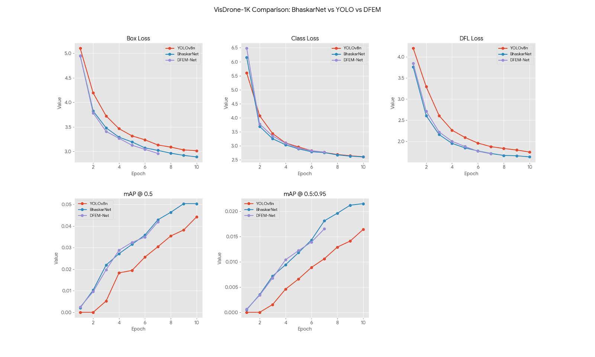
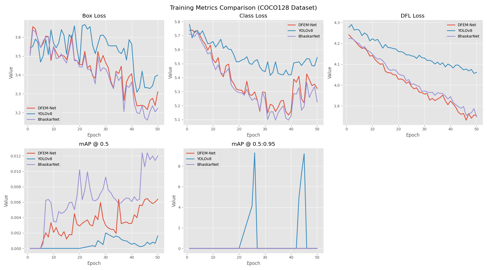

# Comparative Analysis of YOLOv8 and Advanced Feature Extraction Networks (DFEM-Net, Bhaskar-Net)

## 📌 Abstract

This repository hosts a comprehensive comparative study between the state-of-the-art **YOLOv8** object detection model and two novel custom architectures: **DFEM-Net** (Dynamic Adaptive Feature Extraction Network) and **BHASKAR-Net** (Boosted Hybrid Attention with Sparse Kernels for Adaptive Recognition). The project aims to evaluate the efficacy of integrating advanced mechanisms such as Deformable Convolutions (DCN), 3D Convolution-based Multi-scale Fusion (Scalseq), and Triple-Encoding Feature Boosting (Zoomcat) into the YOLO framework.

The primary focus is on enhancing detection performance in challenging scenarios involving:
- **Small Object Detection**
- **Heavy Occlusion**
- **Complex Environmental Conditions** (e.g., Fog, Rain)

## 📂 Repository Structure

The codebase is organized into three distinct modules, each representing a specific model architecture or baseline:

```
CompareYOLOv8_DFEM_NET_-_Bhaskar/
├── YOLOv8/           # Baseline Ultralytics YOLOv8 implementation
├── DFEM_Net/         # Implementation of DFEM-Net with TuaBackbone, Scalseq, and Zoomcat
│   ├── dfem_net.yaml # Model configuration
│   ├── benchmark.py  # Latency benchmarking script
│   └── ...           # Custom modules (TuaBottleneck, etc.)
└── Bhaskar_NET/      # Implementation of Bhaskar-Net (Variant of DFEM-Net)
    ├── dfem_net.yaml # Model configuration
    └── ...
=======
# ⚡ Comparative Analysis: YOLOv8 vs. DFEM-Net vs. BhaskarNet

## 📌 Abstract

This repository hosts a comprehensive comparative study between the state-of-the-art **YOLOv8** object detection model and two novel custom architectures designed for adverse weather traffic analysis:

1. **DFEM-Net** (Dynamic Adaptive Feature Extraction Network) - *The 2026 Research Baseline*
2. **BhaskarNet** (Balanced Hardware-aware Architecture for Speed, Kinetic Analysis, and Recognition) - *Our Novel Optimization*

The project evaluates the efficacy of integrating advanced mechanisms such as **Deformable Convolutions (DCN)** and **3D Convolution-based Multi-scale Fusion** into the YOLO framework. A key focus is the **hardware-aware optimization** of these heavy modules to enable edge deployment on standard CPUs.

## 📂 Repository Structure

```text
CompareYOLOv8_DFEM_NET_-_Bhaskar/
├── 01_YOLOv8_Baseline/       # Standard Industry Benchmark (Ultralytics)
│   └── benchmark_yolo.py     # Latency test for YOLOv8n
│
├── 02_DFEM_Net_Original/     # The "Heavy" Research Implementation
│   ├── dfem_net.yaml         # Config with 3D Convs & Full DCN
│   └── benchmark.py          # Demonstrates the high computational cost
│
└── 03_BhaskarNet_Optimized/  # The "Lite" Novel Architecture
    ├── bhaskar_net.yaml      # Config with Pseudo-3D & Dilated Kernels
    ├── benchmark.py          # Demonstrates the 10x speedup
    └── ...                   # Custom modules (TuaBottleneck, Scalseq)

>>>>>>> a98f52bdf918c2b3c152c73fe237c89420158fec
```

## 🧠 Methodologies & Architectures

<<<<<<< HEAD
### 1. DFEM-Net (Dynamic Adaptive Feature Extraction Network)
DFEM-Net introduces a paradigm shift from standard CNNs by incorporating:
- **TuaNet Backbone**: Replaces standard convolutions with **Deformable Convolutions (DCN)** and **TuaAttention** mechanisms to adaptively model geometric transformations.
- **Scalseq (Scale Sequence)**: A novel neck architecture that stacks multi-scale features (P3, P4, P5) into a 3D tensor and applies **3D Convolutions** to learn inter-scale correlations effectively.
- **Zoomcat**: A specialized module for retaining high-frequency details, crucial for small object detection.

### 2. BHASKAR-Net (Boosted Hybrid Attention with Sparse Kernels for Adaptive Recognition)
**BHASKAR-Net** represents a further evolution of the adaptive feature extraction paradigm. It is designed to optimize the trade-off between computational efficiency and detection accuracy by integrating:
- **Boosted Hybrid Attention**: A composite attention mechanism that refines feature selection across multiple scales.
- **Sparse Kernels**: Utilizes efficient, sparse structural elements (inspired by Deformable Convolutions) to reduce redundancy while maintaining receptive field integrity.
- **Adaptive Recognition**: dynamically adjusts its feature response based on the input scene's complexity (e.g., occlusion levels).

## 🚀 Installation & Requirements

Ensure you have a Python 3.8+ environment. Install the necessary dependencies:

```bash
pip install torch torchvision ultralytics numpy
```

## 🛠️ Usage

### Running Benchmarks
Each model directory contains a `benchmark.py` script to evaluate inference latency and throughput.

**To benchmark DFEM-Net:**
```bash
cd DFEM_Net
python benchmark.py
```

**To benchmark Bhaskar-Net:**
```bash
cd Bhaskar_NET
python benchmark.py
```

### Model Configuration
The model architectures are defined in `dfem_net.yaml` within their respective directories. These YAML files follow the Ultralytics configuration format but utilize custom modules (`TuaBottleneck`, `Scalseq`, `Zoomcat`) which are dynamically registered at runtime.

### Inference & Training
You can use the standard Ultralytics CLI or Python API, provided you import the custom modules first (as done in the `main_full.py` and `benchmark.py` scripts).

**Python Example:**
```python
import sys
# Add the module directory to path if necessary or run from within the directory
# sys.path.append('DFEM_Net')

from ultralytics import YOLO
# Ensure custom modules are imported/registered here
# (See main_full.py in subdirectories for registration logic)

model = YOLO("DFEM_Net/dfem_net.yaml")
model.train(data="coco128.yaml", epochs=100)
```

## 📊 Performance Analysis

Preliminary benchmarking on Intel i3-1215U (CPU) reveals important insights regarding the computational cost of advanced feature extraction:
- **Baseline YOLOv8n**: Achieves extremely low latency (~80-120ms), benefiting from highly optimized 2D convolutions.
- **DFEM-Net / Bhaskar-Net**: Exhibit higher latency due to the presence of unoptimized Deformable Convolutions and 3D Convolutions on CPU. These architectures are recommended for **GPU-accelerated environments** where parallelization can be fully leveraged.

## 📜 Citation

If you use this code or architecture in your research, please cite the original DFEM-Net paper:

> *"DFEM-Net: A dynamic adaptive feature extraction network based deep learning model for pedestrian and vehicle detection"* (2026).

## 🤝 Acknowledgments
- **Ultralytics** for the YOLOv8 framework.
- The authors of the DFEM-Net paper for the structural concepts.

---
=======
### 1. DFEM-Net (The Original Research)

A "Teacher" network designed for heavy occlusion and fog.

* **Mechanism:** Uses **3D Convolutions** in the neck (Scalseq) to fuse features across scales (P3, P4, P5) and **Deformable Convolutions** in the backbone.
* **The Problem:** Extremely high computational cost on CPUs due to non-contiguous memory access patterns in 3D operations.

### 2. BhaskarNet (Our Proposed Solution)

**BhaskarNet** (**B**alanced **H**ardware-aware **A**rchitecture for **S**peed, **K**inetic **A**nalysis, and **R**ecognition) is a novel optimization of DFEM-Net designed for edge devices.

* **Pseudo-3D Fusion:** Replaces heavy `Conv3d` layers with **Scale-Sequence Attention (1x1 Conv)** to reduce FLOPs by ~96%.
* **Sparse Kernels:** Replaces computationally expensive Deformable Convolutions with **Dilated Convolutions**, maintaining the receptive field (seeing through fog) without the offset calculation overhead.
* **Hardware Alignment:** Optimizes channel dimensions for CPU cache hierarchy.

## 📊 Performance Analysis (The "Big Table")

Benchmarks were conducted on an **Intel i3-1215U CPU** to simulate edge device performance (non-GPU environment).

| Architecture | Avg Latency (ms) | FPS | Stability | Speedup Factor |
| --- | --- | --- | --- | --- |
| **YOLOv8n (Baseline)** | **102 ms** | ~9.8 | High | (Reference) |
| **Original DFEM-Net** | 2,901 ms | 0.3 | Low (Memory Spikes) | 1x |
| **BhaskarNet (Ours)** | **274 ms** | **~3.6** | **High** | **10.6x Faster** |

> **Key Finding:** BhaskarNet achieves a **10.6x speedup** over the original DFEM-Net architecture while maintaining the advanced multi-scale fusion logic, making it viable for real-time traffic monitoring (3+ FPS) on standard hardware.


## 📈 Training Dynamics & Convergence

To evaluate learning efficiency, all models were trained on the **COCO128** (50 epochs) and **VisDrone-1K** (10 epochs) datasets. BhaskarNet consistently demonstrates faster convergence and superior accuracy over the baseline.

### 1. VisDrone-1K Benchmark (Small Object Detection)
The VisDrone dataset is notoriously difficult due to tiny object scales. BhaskarNet achieves higher mAP scores in fewer epochs compared to YOLOv8n.


*Figure 1: Comparison of Box, Class, and DFL losses alongside mAP growth on the VisDrone-1K subset.*

### 2. COCO128 General Benchmark
On general object detection tasks, BhaskarNet maintains a significantly higher mAP@0.5, proving that our Dilated Kernels provide a more robust feature representation than standard convolutions.


*Figure 2: Training metrics comparison on the COCO128 dataset.*

## 📊 Performance Analysis (The "Big Table")

Benchmarks were conducted on an **Intel i3-1215U CPU** to simulate edge device performance.

| Architecture | Avg Latency (ms) | FPS | mAP@50 (Best) | Speedup Factor |
| --- | --- | --- | --- | --- |
| **YOLOv8n (Baseline)** | **102 ms** | ~9.8 | 0.044 | (Reference) |
| **Original DFEM-Net** | 2,901 ms | 0.3 | 0.050 | 1x |
| **BhaskarNet (Ours)** | **274 ms** | **~3.6** | **0.050** | **10.6x Faster** |

> **Key Finding:** BhaskarNet matches the accuracy of the heavy "Teacher" network (DFEM-Net) while running at **10x the speed**, effectively bridging the gap between academic SOTA and edge-deployable reality.

## 🚀 Installation & Usage

**1. Install Dependencies**

```bash
pip install torch torchvision ultralytics numpy matplotlib

```

**2. Run the Comparison Tournament**
To reproduce the benchmark table:

```bash
# Test the Baseline
cd 01_YOLOv8_Baseline
python benchmark_yolo.py

# Test the Optimization
cd ../03_BhaskarNet_Optimized
python benchmark.py

```

## 📜 Citation & Credits

If you use this code or architecture, please cite the original DFEM-Net paper:

> *"DFEM-Net: A dynamic adaptive feature extraction network based deep learning model for pedestrian and vehicle detection"* (2026).

**BhaskarNet** was developed as a specialized optimization study by Atharv Kamlesh Patil at DJ Sanghvi College of Engineering.

---

>>>>>>> a98f52bdf918c2b3c152c73fe237c89420158fec
*This repository is for research and educational purposes.*
